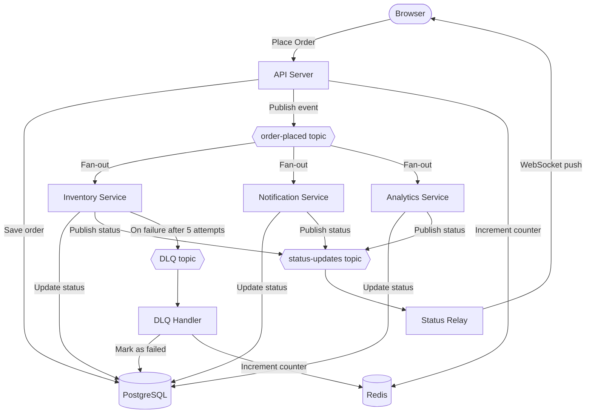

# Event-Driven Order Processing System

A real-time order processing system that demonstrates how independent services can communicate through a message queue — without knowing anything about each other.

---

## What it does

You place an order from the browser. The moment you submit, three independent services spring into action simultaneously — each doing their own job, in parallel, without waiting for the others. As each service finishes, the browser updates live with a checkmark.



---

## The key idea

One order event is published once. Three services each receive their own independent copy. This is called **fan-out** — one message, many consumers, zero coordination between them.

The browser never polls for updates. Instead, a live WebSocket connection pushes status updates the moment each service finishes.

---

## Services

| Service | What it does |
|---|---|
| **Inventory** | Marks the item as reserved |
| **Notification** | Sends an order confirmation |
| **Analytics** | Records the order for reporting |
| **Status Relay** | Bridges service updates to the browser over WebSocket |
| **DLQ Handler** | Catches messages that failed 5 times and marks the order as failed |

---

## Data stores

| Store | Role |
|---|---|
| **PostgreSQL** | Permanent record of every order and its per-service status |
| **Redis** | Fast counters (total orders, failures) + per-consumer dedupe keys |
| **Pub/Sub** | Message bus — decouples the API from the three services |

---

## What you can observe

- **Happy path** — place any order and watch all three checkmarks appear within seconds
- **Failure path** — place an order with item `fail` and watch inventory retry 5 times before being marked as failed
- **Stats bar** — live counters showing total orders placed and total failures
- **Order history** — table pre-loads past orders on page refresh (pulled from Postgres)

---

## Running locally

**Prerequisites:** Docker, Python 3.12+, Google Cloud SDK

```bash
# 1. Start Postgres and Redis
docker compose up -d

# 2. Start the Pub/Sub emulator (separate terminal)
gcloud beta emulators pubsub start --project=demo-project --host-port=localhost:8085

# 3. Activate virtual environment and install dependencies
python3 -m venv venv
source venv/bin/activate
pip install -r requirements.txt

# 4. Set environment variables
export PUBSUB_EMULATOR_HOST=localhost:8085
export GOOGLE_CLOUD_PROJECT=demo-project

# 5. Start the app
uvicorn app.main:app --reload
```

Open `http://localhost:8000` in the browser.

